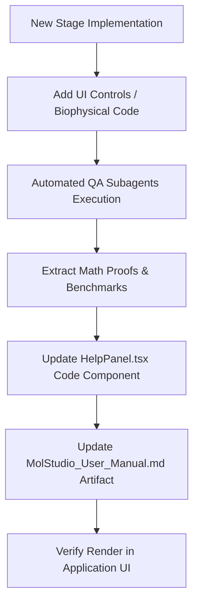

# User Manual Implementation Plan & Architecture

This document defines the implementation architecture, update workflow, and structural design for the **MolStudio Interactive User Manual & Scientific Reference Guide**.

---

## 1. System Goals & Requirements
1. **Click-by-Click Exhaustive Documentation**: Every menu item, ribbon action, context menu command, and sidebar toggle must be documented with exact click sequences.
2. **Real-World Scientific Examples**: Each feature must contain a practical example using standard PDB structures (e.g. `1HVR` HIV protease, `1CRN` crambin, `4HHB` hemoglobin).
3. **Expected Results**: Describes exact visual outputs (e.g. "magenta helix spiral", "cyan dipole vector arrow", "pink selection squares").
4. **Biophysical Justification & Equations**: Explains the underlying physical/chemical laws (DSSP electrostatics, Kabsch SVD alignment, Debye dipole vectors, Catmull-Rom B-splines).
5. **Peer-Reviewed Literature & DOIs**: Direct links to primary papers (Kabsch & Sander 1983, Lovell 2003, Bondi 1964, Carson 1991, Trueblood 1996, Baker & Hubbard 1984).
6. **Continuous Stage-by-Stage Lifecycle**: The User Manual is updated dynamically as each stage (Stages 4 through 8) introduces new biophysical algorithms or UI controls.

---

## 2. User Manual Content Structure

```
MolStudio User Manual
├── 1. Structure Loading & I/O
│   ├── Local File Upload (.pdb, .sdf)
│   └── RCSB PDB REST Fetch
├── 2. Render & Representation Engine
│   ├── Cartoon B-Spline Ribbon
│   ├── B-Factor Putty Heat Scaling
│   ├── Non-Bonded Water & Ion Display
│   └── Surface Isosurfacing (VDW, SES, SASA)
├── 3. Biophysical Validation Suite
│   ├── Molecular Dipole Moment Vector
│   ├── Ramachandran Dihedral Angle Scatter Plot
│   └── DSSP Secondary Structure Assignment
├── 4. Object Control Panel (PyMOL ASHLC Parity)
│   ├── [A] Action Menu
│   ├── [S] Show Menu
│   ├── [H] Hide Menu
│   ├── [L] Label Menu
│   └── [C] Color Menu
├── 5. Selection Algebra & Interactive Console
│   ├── Property & Range Filters
│   ├── Spatial Hash Neighborhood Queries
│   └── AST Command Execution
└── 6. Structural Alignment & Measurement Wizard
    ├── Kabsch Optimal SVD Superposition
    └── 3D Distance, Angle, and Dihedral Wizards
```

---

## 3. Dynamic Maintenance & Verification Workflow



1. **Step 1 (Code Sync)**: When a new feature is added to the codebase (e.g. Putty in Stage 4), its corresponding entry is added to [`HelpPanel.tsx`](file:///d:/Projects/Molexplorer/src/components/HelpPanel.tsx).
2. **Step 2 (Documentation Sync)**: The markdown reference [`MolStudio_User_Manual.md`](file:///C:/Users/mukun/.gemini/antigravity/brain/86ba0017-cb90-4a97-b810-88a7266b3c45/MolStudio_User_Manual.md) is appended with new click paths, equations, and literature links.
3. **Step 3 (QA Subagent Verification)**: Validation subagents execute automated checks against PDB test files to ensure reported metrics match theoretical expectations.

---

## 4. Implementation Schedule across Stages

| Stage | Focus Area | User Manual Updates |
| :--- | :--- | :--- |
| **Stage 4** | Advanced Representations & Controls | Add Putty scaling math, Non-bonded crosses, ASHLC buttons, Viewport context menu, Undo/Redo stack. |
| **Stage 5** | Movie & Keyframing Engine | Add timeline keyframes, camera interpolation matrices, MP4/WebM export controls. |
| **Stage 6** | Electron Density & Crystallography | Add 2Fo-Fc/Fo-Fc CCP4 map isosurfacing, Marching Cubes formulas, unit cell symmetry mates. |
| **Stage 7** | Real-Time Sculpting & Force Fields | Add MMFF94 energy terms, gradient descent minimization, torsion angle manipulation. |
| **Stage 8** | AI Scientific Explanation | Add LLM structural analysis prompts, binding site residue summaries, automated report generation. |
